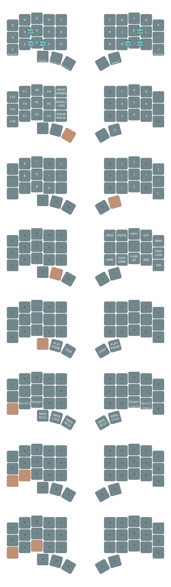

# QMK Configuration

QMK configuration for [charybdis nano](https://github.com/Bastardkb/Charybdis/tree/main) with dual USB setup.
Converted from ZMK configuration to maintain exact same layout and functionality.



## Features

- **Split keyboard with dual USB connections** - Each half connects via its own USB cable
- **5-column layout** with thumb cluster
- **Home row mods** with precise timing (200ms tapping term, 150ms quick tap)
- **8 layers**: Base, Numeral/Function, Symbol, Navigation, Media, Pointer, Scroll, Sniper
- **Trackball support** (PMW3610 sensor on right half)
  - Configurable CPI (2000 normal, 800 sniper mode)
  - Scroll mode for easy scrolling
  - Sniper mode for precision pointing
- **Combos** for mouse clicks on both halves
- **Tap-hold behaviors** matching original ZMK configuration

## Building

To build the firmware:

```bash
# For left half
qmk compile -kb charybdis/left -km default

# For right half  
qmk compile -kb charybdis/right -km default
```

## Flashing

Flash each half separately with its respective firmware:
- Left half: `charybdis_left_default.uf2`
- Right half: `charybdis_right_default.uf2`

## Layer Overview

1. **Base**: QWERTY with home row mods
2. **Numeral/Function**: Function keys and numpad
3. **Symbol**: Symbol keys and brackets
4. **Navigation**: Arrow keys, editing commands
5. **Media**: Volume, playback controls
6. **Pointer**: Mouse control and trackball modes
7. **Scroll**: Trackball scroll mode
8. **Sniper**: Trackball precision mode

## Customization

The configuration maintains identical timing and behavior to the original ZMK setup:
- Tapping term: 200ms
- Quick tap term: 150ms  
- Home row mod hold trigger positions preserved
- Combo timing: 40ms default, 150ms require-prior-idle
